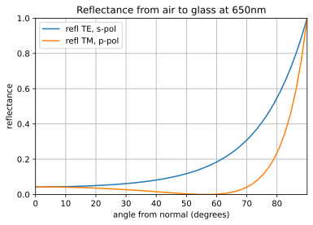
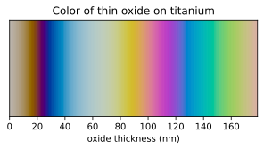
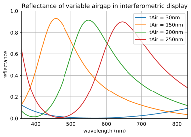
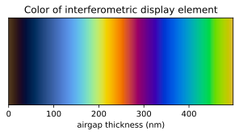

# Thin Film Multilayer Optics Analysis

## General comments

This code is useful for creating optical spectra of thin film multilayer stacks. The basic code leverages the matlab code written by Sophocles J. Orfanidis, which is described well in his book. Both that code and book are available on the link at the bottom. This python code extends the multilayer functionality so that it is specific for optical power, and it analyzes multiple wavelengths with one function call. I have added functions to read material files, calculate the color of spectra, and use Cauchy coefficients of dielectric materials.

Additional material files are available from the links below.

Here are some examples produced with this code:

Air to glass reflections. Compare to the examples of Fresnel equation shown on [https://en.wikipedia.org/wiki/Fresnel_equations]()

The reflected color of titanium depends on the thickness of the oxide layer formed on the titanium. This property is exploited to make colorful jewelry and art.

The imod was a reflective display based on thin film interference that was developed the company Iridigm, later acquired by Qualcomm, but it was not a commercial success. The color of pixels in this display could by changed by varying the thickness of the airgap in the optical thin film stack. The spectra from some selected airgaps is shown here:

The colors of the imod display are shown here over a wider range of airgap thicknesses:

## Links

- [Orfanidis Book and Matlab Code](http://www.ece.rutgers.edu/~orfanidi/ewa)
- [Materials Database](https://refractiveindex.info/)
- [Sopra Database](http://www.sspectra.com/sopra.html)
